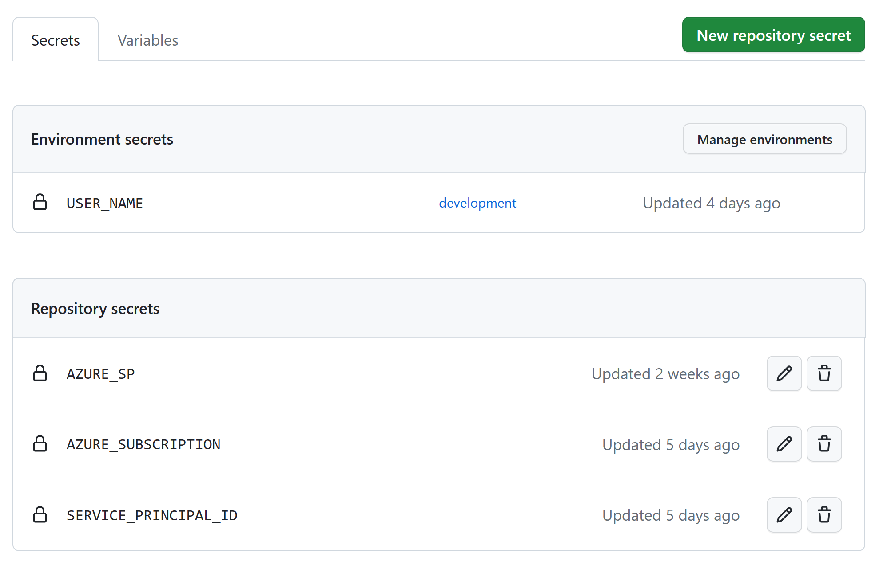
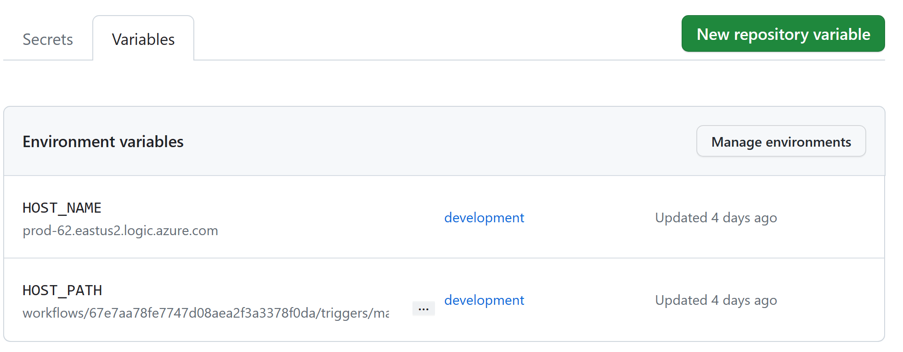
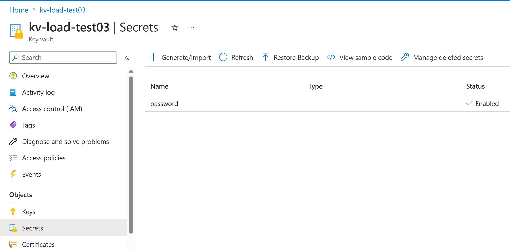

# Azure Load Test with Apache JMeter and GitHub Actions

This repository contains files and scripts to create and deploy an Azure Load Test using Apache JMeter, automate with CI/CD pipeline,  as well as deploying the necessary Azure resources using GitHub Actions and Bicep.

## Table of Contents

- [Azure Load Test with Apache JMeter and GitHub Actions](#azure-load-test-with-apache-jmeter-and-github-actions)
  - [Table of Contents](#table-of-contents)
  - [Introduction](#introduction)
  - [Repository Structure](#repository-structure)
  - [Prerequisites](#prerequisites)
  - [Setup and Deployment](#setup-and-deployment)
  - [What is not Included](#what-is-not-included)
  - [Usage](#usage)
  - [GitHub Action for Azure Load Testing](#github-action-for-azure-load-testing)
  - [Access GitHub Environment Variables and Secrets in JMeter Script](#access-github-environment-variables-and-secrets-in-jmeter-script)
  - [Access Azure Key Valut Secrets in JMeter Script](#access-azure-key-valut-secrets-in-jmeter-script)
  - [Contributing](#contributing)
  - [License](#license)

## Introduction

This repository provides a solution for load testing web applications and APIs hosted on Azure using Apache JMeter and Azure Load Test. The load test is orchestrated and automated using GitHub Actions and Bicep.

The solution allows you to define and execute load tests using JMeter scripts, create the necessary Azure resources (such as a resource group, key vault, and Load Test instance) using Bicep, and deploy the load test infrastructure using GitHub Actions.

## Repository Structure

The repository is organized as follows:

- `test-script/`: Contains the Apache JMeter scripts and related files used for load testing.
- `bicep-template/`: Includes the Bicep files for deploying Azure resources.
- `.github/workflows/`: Contains the GitHub Actions workflow files for automating the load test deployment.
- `README.md`: This file providing an overview and instructions.

## Prerequisites

Before using this repository, make sure you have the following prerequisites in place:

1. An Azure subscription and sufficient permissions to deploy resources.
2. Apache JMeter installed locally or available in your build environment.
3. A GitHub repository with write access.
4. Web application/ API that the Load Test script is going to target.
  
## Setup and Deployment

To set up and deploy the Azure Load Test infrastructure, follow these steps:

1. Clone the repository to your local machine or your GitHub repository.
2. Update the Bicep templates in the `bicep-template/` directory with the necessary configurations for your environment and load test requirements.
3. Customize the JMeter scripts in the `test-script/` directory to suit your application and load testing scenarios.
4. Configure the GitHub Actions workflows in the `.github/workflows/` directory, specifying the required input parameters, Azure Service Principal credentials, and referencing the Bicep files and JMeter scripts.
5. Push your changes to the repository, triggering the GitHub Actions workflows to deploy the infrastructure and execute the load tests.

## What is not Included

This repository does not include the code for creating target Web application or API that is going to be Load Tested. Please create the appropriate resource beforehand and replace the relevant paramters used in the JMeter script.

## Usage

Once the setup and deployment are complete, you can use the Azure Load Test infrastructure in the following way:

1. Open the Azure portal and verify that the resources (resource group, key vault, Load Test instance) are successfully deployed.
2. Use Apache JMeter to further customize the load test scenarios and scripts in the `test-script/` directory.
3. Create the following GitHub "Secrets" and "Variables" at the **Repository** level and **development** environment level.  
   
    
   
4. Create the following Secret in the Azure Key Vault.
   
5. Trigger the GitHub Actions workflow to execute the load tests automatically. The workflow will use the JMeter scripts and the Load Test instance created during deployment.
6. Monitor the load test results in Azure, analyze the performance metrics, and make any necessary adjustments to optimize your application's performance.

## GitHub Action for Azure Load Testing

You can use the Azure Load Testing GitHub action by referencing `azure/load-testing@v1` action in your workflow.  
You will need the following to make it work:  

1. Azure Service Principal for RBAC - For using any credentials like Azure Service Principal in your workflow, add them as secrets in the GitHub Repository and then refer them in the workflow.
2. To authorize the service principal to access the Azure Load Testing service, assign the **Load Test Contributor** role to the service principal.
3. Create or update the secret `AZURE_SP` in your GitHub repository.
4. Further information can be found at this link - <https://github.com/Azure/load-testing>

## Access GitHub Environment Variables and Secrets in JMeter Script

To access the GitHub environment variables in your JMeter script you can refer to the following sample code.  

* You can use the `env` parameter to set the enviroment variables in the Load Test. Here I am using the `HOST_NAME` and `HOST_PATH` GitHub environment variables.
* To access the environment variable you can use this syntax in the JMeter script  
  `${__BeanShell( System.getenv("HostServerName") )}` 
  `${__BeanShell( System.getenv("Path") )}`

* Use `secrets` parameter to set the secrets in the Load Test. Here I am using the `USER_NAME` GitHub secret.  
* To access the secret you can use this syntax in the JMeter script  
  `${__GetSecret(username)}`

```yaml 
- name: 'Azure Load Testing'
        uses: azure/load-testing@v1
        with:
          loadTestConfigFile: './test-script/config.yaml'
          loadTestResource: 'load-test-demo'
          loadTestRunDescription: 'Run from Github CI/CD Workflow'
          resourceGroup: 'rg-load-test'
          env: |
            [
              {
                "name" : "HostServerName",
                "value" :"${{ vars.HOST_NAME }}"
              },
              {
                "name": "Path",
                "value": "${{ vars.HOST_PATH  }}"
              } 
            ]
          secrets: |
            [
              {
                "name": "username",
                "value": "${{ secrets.USER_NAME }}"
                }
            ]
```
## Access Azure Key Valut Secrets in JMeter Script

To access Azure Key Vault Secrets in JMeter Script you have to assign the value in the `config.yaml` file. 
Use the `secrets` parameter to add the secret. Here I am setting the secret `password` to a Key Vault secret's URI.

```yaml
secrets:
- name: password
  value: https://kv-load-test03.vault.azure.net/secrets/password
```


## Contributing

Contributions to this repository are welcome. If you find any issues or have suggestions for improvements, feel free to open an issue or submit a pull request. Please ensure that your contributions align with the repository's guidelines and follow the code of conduct.

## License

This repository is licensed under the [MIT License](LICENSE). Feel free to use and modify the provided code as per the license terms.
